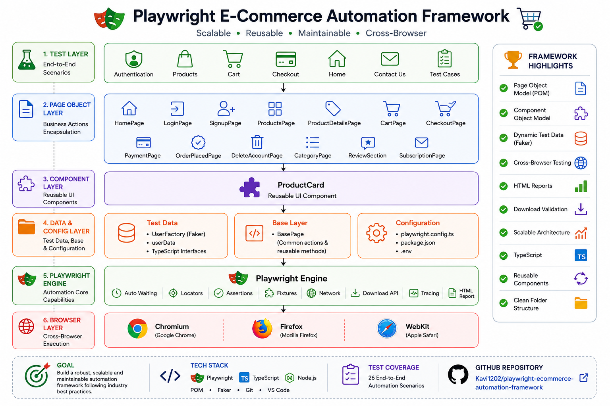

# 🛒 Playwright E-Commerce Automation Framework

> A production-ready Playwright automation framework built with TypeScript following Page Object Model (POM), Component Object Model, reusable utilities, dynamic test data generation, and cross-browser execution.

    

## 📖 About
```
This project automates the complete Automation Exercise e-commerce website using Playwright and TypeScript.

The framework is designed using industry-standard automation practices including:

- Page Object Model
- Component Object Model
- Dynamic Test Data
- Cross Browser Testing
- Reusable Utilities
- Clean Architecture
- Scalable Folder Structure
```
## ✨ Features

```
✅ Playwright + TypeScript

✅ Page Object Model

✅ Component Object Model

✅ Faker Test Data

✅ Cross Browser Testing

✅ Download Verification

✅ Dynamic User Registration

✅ Checkout Flow

✅ Payment Flow

✅ Product Reviews

✅ Search Validation

✅ Category & Brand Validation

✅ Scroll Validation

✅ Clean Git Workflow

✅ HTML Reports
```

## 🏗️ Architecture
<p align="center">

</p>

## 🛠️ Tech Stack

        


## 📂 Folder Structure
```
playwright-ecommerce-automation-framework
│
├── pages/
│   ├── components/
│   ├── BasePage.ts
│   ├── HomePage.ts
│   └── ...
│
├── tests/
│   ├── auth/
│   ├── cart/
│   ├── products/
│   └── home/
│
├── test-data/
│   ├── factories/
│   ├── interfaces/
│   └── userData.ts
│
├── playwright.config.ts
└── package.json
```
## 🚀 Getting Started

```
git clone

npm install

npx playwright install
```
## ⚙️ Running Tests

To run tests, run the following command

```bash

npx playwright test

npx playwright test --headed

npx playwright test --project=chromium

npx playwright test tests/cart

npx playwright show-report
```


## 📊 Reports

Playwright HTML Report


Trace Viewer


Screenshots


## 🎯 Test Coverage
```
| Module         | Tests |
| -------------- | ----- |
| Authentication | 5     |
| Products       | 9     |
| Cart           | 7     |
| Checkout       | 4     |
| Subscription   | 2     |
| Scroll         | 2     |
```
## 🌐Cross Browser

  

## 📈 Future Enhancements

```
GitHub Actions

Docker

Allure Report

Slack Notifications

API Testing

Database Validation

Visual Testing
```

## 👨‍💻 Authors


**Kaviraj P**

Aspiring Quality Engineer focused on:
- Playwright Automation
- QE Framework Design
- API Testing
- GenAI for Testing
- CI/CD Integration

## ⭐ Contribution
```
This project was created to demonstrate modern Quality Engineering automation practices, scalable Playwright framework design, and CI/CD integration.
```
